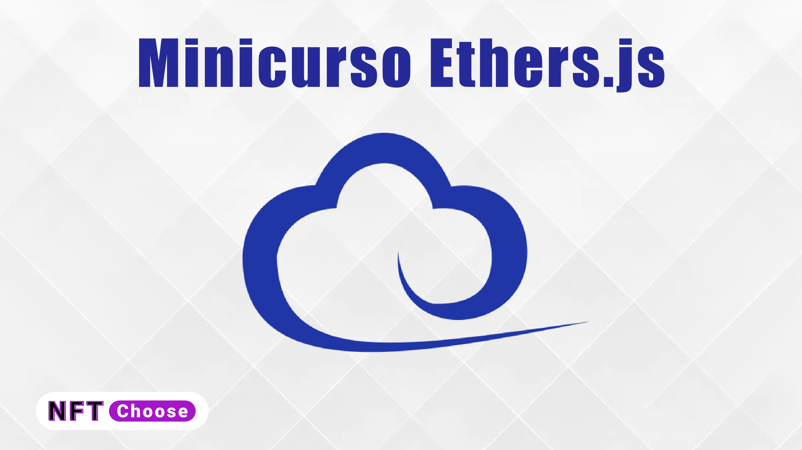

# Minicurso Ethers.js

No Minicurso Ethers.js você aprenderá os conceitos
básicos de uma das libs mais utilizadas em aplicações web3.

Tudo com na prática, no final do curso você desenvolverá um Dapp FullStack com Solidity, Hardhat.js, Ethers.js e React.



[Acesso ao minicurso no YouTube]()

## O que vamos ver nesse mini curso?

- [x] [Introdução ao Ethers.js](https://youtu.be/seym2JW_0Bg)
- [x] [Provider e Signer no Ethers.js](https://youtu.be/ClJVw0Avkz4)
- [ ] API Provider a Ethers.js
- [ ] Criando Wallet | Ethers.js
- [ ] Transferência | Ethers.js
- [ ] Utils no Ethers.js | Ethers.js
- [ ] Criação smart contract com Hardhat.js | Ethers.js
- [ ] Interação com smart contract | Ethers.js
- [ ] Análise de resposta de transações | Ethers.js
- [ ] Análise de métodos para smart contract | Ethers.js
- [ ] Escutando Eventos de smart contract | Ethers.js
- [ ] Dapp de Doação fullstack instalação e configurações | Ethers.js
- [ ] Dapp de Doação fullstack escrevendo smart contract | Ethers.js
- [ ] Dapp de Doação fullstack testando smart contract | Ethers.js
- [ ] Dapp de Doação fullstack deploy smart contract | Ethers.js
- [ ] Dapp de Doação fullstack Frontend React | Ethers.js
- [ ] Dapp de Doação fullstack integrando e finalizando | Ethers.js

## O que é Ethers.js?

O Ethers.js pretender uma biblioteca compact para interação com o Blockchain Ethereum
e seu ecossistema.

## Algumas características(features)

- Matem sua chave privada segura mesmo no seu client
- Importar e exportar carteiras
- Connect se em node do Ethereum por JSON-RPC, INFURA, Etherscan, Alchemy, Cloudflare ou Metamask
- Utilização de ENS(Ethereum name service) names
- Biblioteca muito pequena (~88kb comprimido; 284kb não comprimido)
- Completamente funcional para tod que você precisa no Ethereum
- Totalmente pronta para TypeScript e com uma larga coleção de teste cases
- MIT License

## Terminologia

### Provider

Um providor é uma classe o qual prover uma abstração para uma conexão com Ethereum Network.
Os provedores fornece acesso apenas de leitura para o Blockchain e seus status.

```javascript
  new ethers.providers.[configure_o_provedor_a_conectar]
```

### Signer

Um Signatário é uma classe que geralmente de alguma forma direta ou indireta tem acesso a uma chave privada,
que pode assinar mensagens e transações para autorizar a rede a cobrar de sua conta ether para realizar
operações.

```javascript
const provider = new ethers.providers.Web3Provider(window.ethereum);
// como o signer você está habilitado a assinar e enviar transações
const signer = provider.getSigner();
```

### Contract

Um contrato é uma abstração que representa uma conexão com um contrato específico na rede Ethereum,
para que os aplicativos possam usá-lo como um objeto Javascript

```javascript
new ethers.Contract(tokenAddress, tokenAbi, provider);
```

## Conectando com Ethereum: Metamask

Usar o metamask é a maneira mais rápido para experimentar e começar a desenvolver no Ethereum.

**_Metamask é uma extensão do navegador_**

## Extensões que estou utilizando para VS code

- [Solidity](https://marketplace.visualstudio.com/items?itemName=JuanBlanco.solidity&ssr=false#review-details)
- [Hardhat](https://marketplace.visualstudio.com/items?itemName=NomicFoundation.hardhat-solidity&ssr=false#review-details)

## Importação com Error

Caso seja exibido algum ao importar o contrato do `@openzeppelin`, verifique se configuração do plugin
`solidity` está como no exemplo abaixo.

```shell
  "solidity.packageDefaultDependenciesContractsDirectory": ""
  "solidity.packageDefaultDependenciesDirectory": "node_modules"
```
